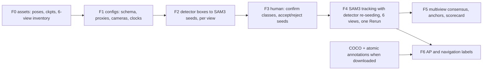
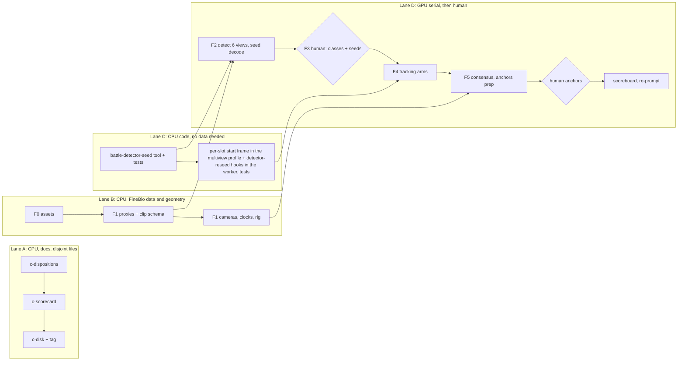

# Plan, Sep 24, 2026: FineBio perception lab, detector-seeded, objects only

**Status: planned, not started.** Written down at the Assembly101 close (ledger, "Sep 24:
Assembly101 phase closed") so the next phase has a fixed text to be measured against, the way
[`plan-2026-09-08-assembly-rerun-lab.md`](plan-2026-09-08-assembly-rerun-lab.md) served the
first. The body below is Part 2 of the close-out plan
(`/home/nick/.cursor/plans/finebio_pivot_and_assembly101_closeout.plan.md`, sections "Part 2:
FineBio perception lab, detector-seeded, objects only" through F6 and Docs, "Parallelism", and
"Costs and stop rules"), copied verbatim; its lane A (the `c-*` close-out todos) is done and
its F0-F6 / `f-docs` todos are all `pending`. Nothing in it has run: no proxy, no config, no
detector pass, no seed, no GPU job. When work starts, the ledger gets a dated entry per phase
and this file stays as written.

## Asset verification, Sep 24 (CPU, read-only)

What is on disk under `data/raw/finebio/` (gitignored; extraction logs `*.7z.log` beside each
archive's directory), checked before the plan was written down:

- **Camera poses**: `misc/finebio_camera_poses/` extracted (`finebio_camera_poses.zip` kept
  beside it): `intrinsic_parameters/` with two GoPro configurations
  (`gopro9_5_wide_4k_43_0.50.npz` for the fpv 4K 4:3 wide, `gopro9_6_linear_4k_169_0.50.npz`
  for the tpv 4K 16:9); `third_person_camera_poses/` with ten recording-day directories
  (`221013` ... `221208`, each `extrinsics/` and `params/`); `first_person_camera_poses/` with
  226 per-trial `.npz` files; the authors' `README.txt` and two `vis_*.py` scripts.
- **Checkpoints**: `ckpts/` holds the seven shipped files (`dino.pth`, `dino_checkpoint_e30.pth`,
  `deformable-detr.pth`, `handobj_checkpoint_e5.pth`, `actionformer.pth.tar`, `asformer.model`,
  `mstcn.model`). The object detectors are the ones `scripts/finebio_dino_detect.py` ran on
  Sep 21.
- **Six-view inventory**: `finebio_videos_fpv_test/finebio_videos/` has 35 fpv trials and
  `finebio_videos_tpv_test/finebio_videos/` 175 fixed-camera videos = 35 trials x `T1..T5`, so
  **35 trials have all six views**. `P03_01_01` is one of them (`P03_01_01.mp4` plus
  `P03_01_01_T1..T5.mp4`) and already has the Sep 21 20 s proxy.
- **P03_01_01 is frame-aligned by construction**: `first_person_camera_poses/P03_01_01.npz`
  holds `rets (5032,) bool`, `rots (5032, 3, 1)`, `trans (5032, 3, 1)`: 5032 per-frame entries
  (4890 valid), the same count as all six videos.
- **Detection-image frames**: `finebio_object_detection_images/finebio_object_detection_images/`
  holds the frames the authors annotated; for `P03_01_01` they are **390, 941, 3485, 4793**
  (`P03_01_01_000390.jpg` etc.). F6 puts anchors there.
- **Two mappings are not shipped**: participant -> recording day, and video suffix `T1..T5` ->
  camera id `{1,2,3,4,6}`. F1 recovers them empirically (AR-marker PnP against each day's
  `marker_points.npy`) and asks the authors in parallel.
- **Annotations assumed unavailable**: `finebio_coco_annotations.zip` and the atomic-operation
  `.txt` set are not on disk and are treated as not coming (F6 is the no-annotation
  evaluation); `tpv_train` (63 GB) is not extracted and not needed.

Licence rule, as in the plan: non-commercial research; no frame, video, mask or `.rrd`
committed; `runs/` and `data/` gitignored; no sharing determination made.

---

## Part 2: FineBio perception lab, detector-seeded, objects only

Pivot from the Assembly101 method: **the FineBio shipped object detector seeds SAM3 instead of a human**, and **hands are skipped** (no MediaPipe, WiLoR, hand-object detector, ATHENA, or hands preset). The detector already exists in the repo (`scripts/finebio_dino_detect.py`, DINO and Deformable DETR, 35 classes) and on the Sep 21 clip it boxed the pipettes, tip racks, tubes, tube racks, plate, centrifuge, vortex mixer and PCR machine at 0.8-0.96 on most frames; that is the seed source Assembly101 never had. The human's role shrinks to a taxonomy confirmation, an accept/reject pass over detector seeds, and anchors for scoring.

Licence rule throughout: non-commercial research, no frame/video/mask/RRD committed, `runs/` and `data/` gitignored, no sharing determination made.

### F0: assets (CPU, 1 h)
- Extract `misc.zip/finebio_camera_poses.zip` and `ckpts.zip` under `data/raw/finebio/` with extraction logs; read the pose format (per-camera intrinsics? extrinsics per trial or per session?) and record it. Do not extract `tpv_train` (63 GB, not needed).
- Inventory trials that have the fpv clip in `fpv_test` and all five `T1..T5` in `tpv_test`; P03_01_01 qualifies and already has a 20 s proxy. Choose the trial and a 60 s window with the most hand-object activity (contact sheet across the six views at 6 frames for the human).
- `docs/SOURCES.md` / `LICENSES.md` entries for the poses and the seven checkpoints (the hand-object detector is Shan et al. 2020; the step/atomic models are I3D-based). Flag the two missing archives (`finebio_coco_annotations.zip`, atomic-operation `.txt` set) for re-request via the form.

### F1: configs, proxies, cameras, clocks (CPU, 2-3 h)
- Generalize the clip config: a `finebio_preprocessing` manifest kind (or a `source_dataset` discriminator on `G2PreprocessingManifest`) with the same proxy/checksum/clock fields and no Hugging Face provenance; the `clip.views == ("static-c10379",)` asserts in `interaction_review`, `exploratory_comparison`, `kineo_fusion` and the four-part `TARGETS` constant become config-driven (this is the generalization pass 1 of the multicam plan started; finish it). Raw-video SHA-256 in the config is acceptable per the SOURCES policy; frame-level checksums stay in `runs/`.
- Proxies: six views, 30 fps CFR, 1280 wide (fpv 1280x960; fixed cams per their aspect), same libx264 arguments, 60 s window; `media_probe` sidecars.
- Cameras (assets verified Sep 24, extracted under `data/raw/finebio/misc/finebio_camera_poses/`): chessboard intrinsics for the fpv (4K 4:3 wide) and tpv (4K 16:9) GoPro configurations, rescaled to the proxy size; per-recording-day extrinsics for fixed cameras `1,2,3,4,6` on 10 days (checkerboard world at the table centre); 12 AR-marker world points per day; a per-frame fpv pose for every trial (P03_01_01: 5032 entries, 4890 valid, same count as all six videos, so the views are frame-aligned by construction). **Two mappings are not shipped**: participant -> recording day, and video suffix `T1..T5` -> camera id `{1,2,3,4,6}`. Recover them empirically: detect the AR markers in one frame of each T view (they are ArUco-style; try cv2.aruco dictionaries), PnP against each day's `marker_points.npy`, pick the day/camera whose extrinsic reprojects the markers best; record the residuals as the mapping's evidence and email the authors for confirmation in parallel. If no day fits under 10 px, calibrate the fixed cameras ourselves from the markers (PnP per view) and mark `provenance: marker_pnp`.
- Clocks: FineBio states the views are synchronized; verify without hands by a cross-view scan on a moving object's detector boxes (a pipette or tube the detector tracks in 3+ views: triangulation residual of box centres vs frame offset over -15..+15) and record per-view offsets with uncertainty.
- Rig check: triangulated consistency of a static object's box centres (centrifuge, PCR machine) across the five fixed cams.

### F2: detector boxes to SAM3 seeds (GPU, about 1 h)
- Run DINO and Deformable DETR on all six proxies (fold `scripts/finebio_dino_detect.py` into a `battle-finebio-detect` driver with the standard manifest; the CPU env does ~1.5 s/frame, so detect every 5th frame for the 60 s window, all views, ~40 min).
- New `battle-detector-seed`: for each view and each class the human keeps, choose seed frames and boxes by temporal persistence (class present with score >= 0.5 on >= N consecutive detections, box IoU-stable), one slot per instance (greedy box-IoU association across frames, so two `50ml_tube`s become two slots), cap slots per view (default 8) by persistence; decode each seed box with the SAM3 image decoder (two margins, other-instance centroids as negatives, decoder top score, the seed-search winner), accept by the area band vs the detector box. Seeds may start mid-clip (a per-slot start frame; this is the capability the Assembly101 pass lacked, build it here in the multiview profile). Provenance on every seed: detector, class, score, frame, box, candidate scores; `selected_by: detector`. Per-view contact sheet of seeds with class-family colours.

### F3: taxonomy gate and seed review (your time, about 15 min)
- You confirm which detector classes become tracked slots (proposal: pipettes, tips, tip racks, tubes, tube racks, plate and lid, centrifuge, vortex mixer, PCR machine, trash can, pen; `left_hand`/`right_hand` excluded by design), and accept/reject the detector seeds per view from the sheet. No drawing. Rejected seeds are recorded and dropped; nothing is redrawn by hand.

### F4: tracking on six views (GPU about 3 h via the queue)
- SAM3 (MuggledSAM) detector-seeded at 1280 `pm-append` on all six views. **Detector-driven re-seeding**: at every detected frame, if a slot has no mask or its mask box IoU with the same-class detection is below 0.3 for K consecutive detections, re-prompt the slot from the detector box via the image decoder (`selected_by: detector`, provenance `detector_reseed`), and if a persistent detection matches no slot, open a new one (within the cap). This replaces both the human corrections and the consensus corrector of Assembly101 in one mechanism. Arms: seed-only (no re-seeding), detector-reseed, plus DAM4SAM large detector-seeded on the fpv view. Five measures per run; the detector boxes logged beside the masks; one Rerun via the v6 builder with segmentation and multiview presets (no hands preset).

### F5: multiview and scoring (GPU 2 h, your time 1 h)
- Consensus and hull from the five fixed cameras on the slots present in 3+ views, fpv gated by pose as e4 was; detector scorecard confidence series with a new detector: detector-box-vs-mask disagreement (this is the one signal we lacked on Assembly101, and it is label-free).
- Anchors: 13 detector-selected plus random frames on the fpv and one fixed view, same tooling; scoreboard over every arm; consensus-only re-prompt vs detector-reseed vs seed-only. The transparent plate and racks are the intended hard cases; whether the detector-seeded loop holds them without a human is the question.

### F6: evaluation without annotations (decision: the COCO and atomic-operation archives are not coming)

Treat this as the realistic condition: a customer's footage ships no ground truth either. What we evaluate with is what a deployment would have: a pretrained detector, synchronized cameras, the model's own confidence, and a human checking a handful of frames.
- **Detector-agreement proxy** in the detector scorecard: DINO vs Deformable DETR box agreement per class, and each vs the SAM3 mask box. Agreement of two models is not truth (Assembly101 frame 1533: 0.997 cross-camera agreement, IoU 0.00); it is a ranker for where to look, and every table says so.
- **Anchor frames on the shipped detection images**: `finebio_object_detection_images/` holds the frames the authors annotated; for P03_01_01 they are 390, 941, 3485, 4793. Choose the 60 s window to contain at least two of them and put anchors there, so a later annotation download would land on the same frames for free.
- **Optional step strip**: the shipped MS-TCN++/ASFormer checkpoints predict the protocol step from I3D features; if the navigation panel is missed, run one on the fpv clip and label the strip as model output, not GT. Not on the critical path.
- **Two cautions recorded in every FineBio table**: the shipped detector was trained on FineBio, so its seeding quality here is an upper bound for a new lab's bench; and the human anchors remain the only truth, selected by detector disagreement plus a random draw as before.

### Docs
Ledger per phase, `docs/review-guide-<date>-finebio.md`, README FineBio section; SOURCES/LICENSES kept current.

## Parallelism

Four lanes; the GPU is the one serial resource and the human gates are the two synchronisation points.

- **Start together (t = 0):** Lane A (close-out; touches only the ledger, records, README, tag), Lane B (F0 then F1: extraction, proxies, schema generalization, cameras), Lane C (`battle-detector-seed`, the per-slot start frame and detector re-seed hooks in `muggled_smoke`/`muggled_worker`, all unit-tested against stubs; no data or GPU needed). File ownership is disjoint: A owns docs/qa and the ledger tail; B owns `assembly101_*`-style fetch/proxy/camera modules, `schemas.py` clip-config hunks, `configs/clips/finebio_*`; C owns `detector_seed.py`, `muggled_smoke.py`, `muggled_worker.py`, `multiview_schemas.py`. Shared `schemas.py`: staged by hunk as before.
- **D1 (detector runs + seed decode) needs B1a proxies and C1's tool**; the detector itself runs on the CPU env (~1.5 s/frame, so run it as soon as proxies exist, in parallel with C1 finishing, and decode seeds when C1 lands). Cameras/clocks (B1b) are not needed until D3.
- **Human gate 1 (F3, ~15 min):** the only thing blocking D2. Everything in lanes A, B, C should be finished before you are asked, so the gate is a single sitting.
- **D2 tracking arms** are GPU-serial (~3 h) and need C2; D3 consensus/hull is CPU and can start the moment the first views finish; anchor prep is CPU.
- **Human gate 2 (anchors, ~1 h)** is the last blocker; the scoreboard and re-prompt arm follow.
- **F6** is independent and starts whenever the annotation archives arrive.

Critical path: B0 -> B1a -> D1 -> H1 -> D2 -> D3 -> H2 -> D4, roughly 1 h + 2 h + 1 h + human + 3 h + 1 h + human + 1 h. Lanes A and C are off the critical path entirely.

## Costs and stop rules
- Part 1 about 2 h CPU. Part 2: F0-F1 about 4 h CPU, F2 about 1 h, F4 about 3 h GPU, F5 about 3 h; your time: F3 15 min, anchors about 1 h.
- If the pose files carry no usable intrinsics and the box-centre rig check exceeds 30 px, multiview runs as a single-view lab on the fpv plus one fixed camera and the consensus is recorded as not available.
- If the detector misses a class the human wants tracked on every seed frame (the transparent plate is the candidate), that slot is recorded as `detector_unseeded`, not hand-drawn; the finding is the point.
- Hands stay out of scope for this phase; the hand tooling remains in the repo untouched.
- Every table says: anchors are review evidence on a handful of frames, one person's choice of decoder masks, not ground truth.
