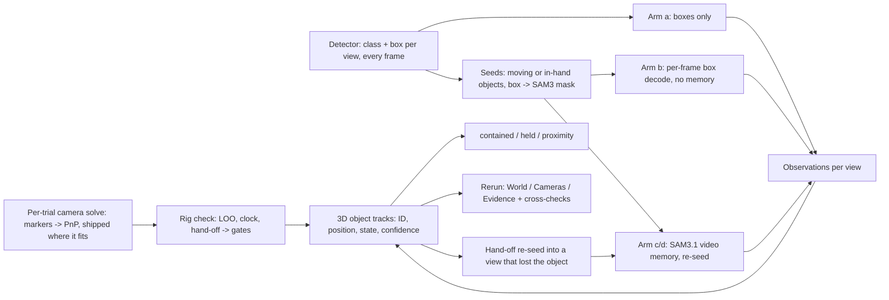
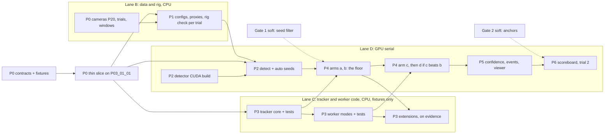

# Plan, Sep 25, 2026: FineBio 3D object tracking demo

**Status: approved Sep 24, 2026 (night), build started.** The todo list below is the plan's
own (the `todos` frontmatter of
`/home/nick/.cursor/plans/finebio_3d_object_tracking_demo_5b2e9c17.plan.md`, every item
`pending` at approval), and the body after it is that file's text copied verbatim. This file is
the fixed text the phase is measured against, as
[`plan-2026-09-24-finebio-detector-seeded-lab.md`](plan-2026-09-24-finebio-detector-seeded-lab.md)
was for the previous draft (superseded by this one after the Sep 24 preflight,
[`preflight-2026-09-24-finebio.md`](preflight-2026-09-24-finebio.md), rewrote it). When the
plan changes, the change is a dated ledger entry, not an edit here.

Plan frontmatter: `name: FineBio 3D object tracking demo`; overview:

> One perception lab on FineBio built around a single idea: the tracked entity is a 3D object with a persistent identity, and every camera's SAM3.1 mask is an observation of it. FineBio's shipped detector supplies class, instance and the box that is SAM3's only prompt; the six-camera calibration (shipped, with the top-down camera re-solved from the bench markers) ties the views into one world frame; a new multi-view tracker owns birth, association, occlusion states, re-acquisition and cross-camera hand-off. Rewritten Sep 24 after the preflight (docs/preflight-2026-09-24-finebio.md) settled the camera mapping, the transparent plate, the rig accuracy and the trial choice. Confidence and abstention are first-class outputs; a boxes-only control and a memory-free per-frame decode arm decide whether SAM3's video memory pays for itself; a second trial from the other room proves it generalizes. No hands as tracked objects, no atomic operations, no per-tube identity inside racks.

## Todos (the plan's own, at approval)

| id | content |
|---|---|
| `p0-contracts` | Data contracts first, so the lanes can work apart: observation, camera-config, track and event schemas in multiview_schemas.py; the preflight's P03_01_01 detections and SAM3 masks converted into observation fixtures under tests/ (lane C develops against them, no GPU); frame-index contract as a real_data test: proxy frame k == raw frame start+k on three frames, pose length == raw frame count, marker reprojection < 10 px on the proxy |
| `p0-slice` | Thin vertical slice on the preflight window of P03_01_01 (60 consecutive frames, six views) before any phase scales up: fixtures -> per-frame same-class triangulation -> 3D points, residuals and the seven cross-checks in one Rerun recording. This is also the floor demo (arm b + per-frame triangulation + cross-check viewer) that ships if the tracker lane runs late |
| `p0-cameras` | Per-trial camera solve as a battle-finebio-cameras step: ArUco DICT_6X6_50 on N frames per fixed view, PnP against the day's marker_points, shipped pose kept only where it agrees within 10 px, else marker_pnp (camera 6 always); day chosen by summed residual; fpv pose = shipped with a marker-residual/velocity outlier gate; camera config JSON per trial with provenance. Regression: reproduces the preflight residuals on P03_01_01 within tolerance. P03 (day 221013, T1..T5 = 1,2,3,4,6) done in the preflight; run it for P20_03_01 (room 2 rig) |
| `p0-trials` | Trial 1 = P03_03_01 (protocol 03, 283 s, 8492 frames all views, fpv pose 99.0% valid): pick a ~120 s window containing the six-view annotated frame 916 and at least two centrifuge cycles (top-down contact sheet, centrifuge lid state per frame); trial 2 = P20_03_01 (room 2, protocol 03, six-view frame 1442); P03_01_01 stays the smoke; SOURCES/LICENSES for poses and ckpts |
| `p1-configs` | finebio_preprocessing manifest kind (no HF provenance): proxies at native resolution (fixed 1920x1080, fpv 1920x1440) and native 30000/1001 fps with no fps filter so proxy frame i = raw frame start+i and the shipped pose indexes line up; window trimmed on exact frames; media_probe sidecars; intrinsics rescale 0.5 / 0.48 recorded; undistorted normalised coordinates for every triangulation; config-driven view/target asserts replacing the Assembly101 constants |
| `p1-rig` | Rig check as a standing battle-finebio-rig step (the preflight's rig subcommand generalised): static-object five-view triangulation with LOO, half-height sanity, hands as probes, clock scan, fixed-to-fpv hand-off residual. Gates are formulas evaluated per trial and written into its config (association = 3x the static LOO median, hand-off = the moving-object LOO p90, with a floor and a cap), never constants; P03's 30 / 50-60 px are the expected range. Regression: reproduces the preflight numbers on P03_01_01 within tolerance. Run on trial 1's window and on trial 2 |
| `p2-detect` | battle-finebio-detect: DINO (Deformable DETR kept as the agreement check) on the six proxies with the standard manifest. GPU build of the detector venv (mmcv CUDA ops) so every frame of the window is detected (~60 ms/frame); fallback if the CUDA build fails: CPU at every 3rd fpv / 5th fixed frame with linear box interpolation between detections, flagged in provenance |
| `p2-seeds` | battle-detector-seed: per-view instance formation by IoU association across detections; a slot is opened for objects that move (box displacement over a window) or sit inside a hand box, at score >= 0.3 with persistence, plus a named container set (centrifuge, racks) as static volumes; bench objects that never move stay detector-only; SAM3 image-decoder mask from the tight box (decoder top IoU, other-instance centroids as negatives), accepted by mask-bbox IoU vs the box >= 0.6 (not fill ratio); per-slot start frame; provenance selected_by: detector with class, score, frame, box, candidate scores; per-view seed sheets |
| `p2-gate1` | Human gate 1, soft (~15 min, not blocking): the pipeline runs on with auto-accepted seeds (provenance auto); the human confirms the slot shortlist (plate, pipettes in use, tubes in use, tip rack in use, centrifuge, vortex, pcr_machine as containers/landmarks) and accepts/rejects seeds per view from the sheets whenever convenient; the decisions are applied as a filter and only rejected slots are re-run; nothing drawn |
| `p3-tracker` | battle-multiview-tracks core (new module, developed against the p0-contracts fixtures, time-boxed to the duration of arms a/b): observations = per-view mask centroid (box centre when the mask fails the bbox-IoU check), class, SAM3 score, detector score, area, pose validity; birth by pairwise same-class triangulation + gate + assignment with >= 3 fixed views, or 2 fixed views + the fpv when its pose is valid; 3D state with a stationary prior; predict-project-gate update; states observed / single_view / coasting / lost; re-acquisition only when class-confirmed by the detector and consistent across >= 2 views, ambiguity kept as possibly_same_as; hand-off re-seed box emitted; tracks.jsonl + events.jsonl + identity metrics; synthetic-rig tests |
| `p3-tracker-ext` | Tracker extensions, each added only if the occlusion inventory from arms a/b shows episodes that need it: held (follows a hand box), contained (follows a container volume, centrifuge lid state), identical-instance group tracks (tubes in a rack, one track until a member leaves). Not part of the floor |
| `p3-worker` | Worker modes and hooks: (i) memory-free per-frame box-decode mode (boxes in, masks out, no video memory); (ii) video-memory mode with skip-memory-write when object score < tau, mid-stream re-prompts with provenance (detector_reseed, track_reproject); tests |
| `p4-arms` | GPU arms via the queue on trial 1, six views, 1280 only, in an order where each arm can cancel the next: (a) boxes-only control and (b) per-frame box-decode with no memory first (no new worker needed, the floor's inputs); then (c) SAM3.1 video memory seeded once (preflight style); (d) (c) + detector re-seed + hand-off re-seed only if (c) beats (b) by 0.02 on the label-free measures; (e) DAM4SAM large on the fpv, optional. Five measures + identity metrics + cross-view residuals + occlusion inventory per arm; each arm's first view is sanity-checked against the preflight (ms/step, det-box IoU) before the queue continues |
| `p5-confidence` | Scorecard extension: detector-vs-mask bbox IoU, cross-view residual, SAM3 object score, detector score -> per-track confidence + abstain flag; DINO vs DDETR agreement kept and marked near-redundant |
| `p5-events` | Object-object events from 3D tracks with hysteresis: contained (tube enters the centrifuge volume; centrifuge lid state open/closed from the detector box or a mask on the lid), held (inside a hand box), proximity (pipette tip in plate volume); events strip labelled model output. No tip or lid attachment events (no observable) |
| `p5-viewer` | One .rrd + presets World / Cameras / Evidence, with the seven preflight cross-checks as standing entities on every build: marker reprojection per view, fpv camera centre in the fixed views, static-object triangulation + LOO, hands as probes, clock scan, LOO on moving objects, fixed-to-fpv hand-off residual; one negative control in Evidence (camera 6's shipped pose beside the marker-PnP pose) so the checks are seen to catch an error; six tiles with masks, boxes, IDs, abstain; storyboard frames marked on the timeline |
| `p6-anchors` | Human gate 2, soft (~1.5 h): anchors on the six-view annotated frame (916) in all six views, plus 12 disagreement-selected and 5 random frames on the fpv and one fixed view; per-anchor instance identity; the scoreboard over arms (a)-(e) (IoU, ID switches, fragmentation, re-acquisition latency, cross-camera IDF1) runs whenever labels exist and re-runs as more land |
| `p6-trial2` | P20_03_01 with its own camera solve and rig check, identical settings otherwise, zero per-trial tuning; same metrics; both trials in the viewer; anything that only helps trial 1 is named as overfit |
| `p-docs` | Ledger per phase; this plan copied into docs/plan-2026-09-25-finebio-3d-tracking.md on approval; docs/review-guide-<date>-finebio-3d.md with the storyboard; README FineBio section; commit |

## Plan body (verbatim)

# FineBio 3D object tracking demo

## What the preflight settled (Sep 24, `docs/preflight-2026-09-24-finebio.md`)

Every item below was measured on the data; the plan is built on these numbers, not on the
Assembly101 experience.

- **Cameras.** `T1..T5` are cameras `1,2,3,4,6` in order. P03 is day 221013. Cameras 1-4 fit
  their shipped extrinsics to 2-7 px on the bench markers; **camera 6 (top-down) is 6.4 cm /
  94 px off on every shipped day** and is re-solved from the markers (0.7 px). The shipped fpv
  pose is a per-frame marker PnP good to 0.9 px on 97-99% of frames, with ~1.5% outlier
  frames; its camera centre lands on the head-mounted GoPro in the fixed views.
- **Clock.** Six videos synchronised to 0 +/- 1 frame. No per-view offsets.
- **Rig.** Five-view triangulation of eleven static objects returns half their physical heights
  in centimetres; leave-one-view-out residual 10 px median / 25 px p90 at 1920. The plate
  triangulated from four views lands inside the fifth view's box on 98-100% of frames, and
  projected through the fpv pose it lands inside the fpv detector box on 45/45 frames (37 px
  median). Cross-camera hand-off is feasible with the shipped calibration.
- **SAM3 with a detector box as its only prompt** segments the transparent plate in all six
  views (mask-bbox IoU vs detector 0.77-0.94, down to 83x48 px) and holds plate, pipette,
  centrifuge and a tube for 300 frames in four views (IoU 0.70-0.98; one 14-frame arm
  occlusion re-acquired on the same tube). 220 ms/step for four slots at 1280, 2.6 GiB.
  Encoder 1920 adds nothing (mean delta -0.002). Single micro tubes at 17-28 px are marginal.
- **Detector.** Works on all five fixed views (24-39 boxes/frame; bench objects 0.8-0.94), but
  **the object in the hand is the weakest detection in every fixed view (0.44-0.57)**; the
  raised in-hand object has >= 3 fixed views on only 14/61 frames, the resting hand on 61/61.
- **Trial.** Protocol 01 barely moves anything for 168 s. `P03_03_01` (protocol 03, same rig,
  six centrifuge cycles, tubes and a tip rack relocated, six-view annotated frame 916) is the
  trial; `P20_03_01` is its room-2 counterpart (six-view frame 1442).

## Decisions taken

- **Spine:** FineBio DINO (Deformable DETR as the agreement check) gives class, instance and a
  tight box per view; SAM3.1 (MuggledSAM v3p1) at 1280 gives the mask from that box; the
  per-trial camera solve (shipped poses where they fit, marker PnP where they do not) ties
  six views into one world frame; a new multi-view tracker owns identity.
- **The tracked entity is a 3D object.** Persistent ID, world position, class, state. Per-view
  masks are observations. Cross-view association is solved at birth by triangulation and
  thereafter by predict-project-gate against the 3D state, with gates taken from the rig check.
- **Two mask arms decide whether video memory is needed.** Per-frame box-prompted decode (no
  memory, cannot drift) against SAM3.1 video memory (seeded once, and with re-seeding); the
  boxes-only control sits under both.
- **Confidence and abstention are outputs**, drawn in the viewer.
- **Out of scope:** hands as tracked objects (hand boxes are occluders and probes), per-tube
  identity inside racks (below resolution from the fixed cameras), tip and lid attachment
  events (no observable), atomic operations, step segmentation, VLMs, audio, Kineo, SAM3
  memory ablations, the 1920 encoder, PVS prompt search and exemplar arms for the plate, any
  training. The FineBio annotation archives (COCO boxes, atomic operations) are treated as not
  available: the plan runs without ground truth, and the human anchors are the only truth.
- **Licence:** FineBio non-commercial research; nothing under `data/` or `runs/` is committed;
  no sharing determination is made by this plan.

## How this plan fails safely

- **Thin slice before scale** (`p0-slice`). The preflight window of `P03_01_01` (60 frames,
  six views, detections and SAM3 masks on disk) goes through the whole chain first:
  observations -> per-frame triangulation -> 3D points, residuals and cross-checks in one
  recording. Integration bugs (frame offsets, coordinate frames, timelines) surface on 60
  frames, not on 120 s x 6 views x 5 arms.
- **A floor that ships.** The slice, scaled to the trial window, is the floor demo: arm (b)
  per-frame decode + per-frame triangulation + the cross-check viewer. It needs no new tracker
  code. Phase 3 is time-boxed to the wall-clock of arms (a)/(b); if the tracker core is not
  passing its tests by then, the floor ships and the tracker continues as upside.
- **Soft human gates.** Nothing in the GPU lane waits for a sitting. Seeds run auto-accepted
  (`provenance: auto`) and the human's accept/reject is applied afterwards as a filter;
  anchors are labelled on frames already chosen and the scoreboard runs whenever labels exist.
- **Gates are formulas.** Every geometric gate is computed from the trial's own rig check
  (association = 3x static LOO median, hand-off = moving-object LOO p90, floor and cap) and
  written into its config; P03's 30 / 50-60 px are the expected range. That is what makes
  "zero per-trial tuning" on trial 2 a fact rather than an intention.
- **Contracts first** (`p0-contracts`). Observation, camera-config, track and event schemas
  land before the lanes split; lane C develops the tracker against recorded preflight
  observations as fixtures and never waits for lane D.
- **The frame-index contract is a test**: proxy frame k == raw frame start+k, pose length ==
  raw frame count, marker reprojection under 10 px on the proxy. The Assembly101 clock hunt
  cannot recur silently.
- **Minimal tracker first** (`p3-tracker`), extensions on evidence (`p3-tracker-ext`): `held`,
  `contained` and group tracks are added only if the occlusion inventory from arms (a)/(b)
  shows episodes that need them.
- **Arms in cancelling order.** (a) and (b) first (no new worker), then (c); (d) only if (c)
  beats (b); (e) optional. The first view of every arm is sanity-checked against the preflight
  numbers before the queue continues.
- **Preflight as regression.** `battle-finebio-cameras` and `-rig` must reproduce tonight's
  residuals on `P03_01_01` within tolerance; the geometry code gets regression coverage for
  free.
- **One negative control** in the Evidence preset (camera 6 shipped vs marker-PnP), so a viewer
  sees the cross-checks catch a real error.
- **Left open on purpose:** K frames before a re-seed, tau for memory writes, hysteresis
  widths, the window length, the tracker's motion model beyond a stationary prior. These are
  read off the data when it exists.

## Phase 0: contracts, slice, cameras, trials (CPU, about 4 h)

- **Contracts** (`p0-contracts`): observation, camera-config, track and event schemas in
  `multiview_schemas.py`; the preflight's `P03_01_01` detections (6 views x 78 frames) and SAM3
  track series converted into observation fixtures under `tests/`; the frame-index contract as
  a `real_data` test.
- **Thin slice** (`p0-slice`): fixtures -> per-frame same-class triangulation -> 3D points,
  per-view residuals and the seven cross-checks in one Rerun recording, on the 60-frame
  preflight window. Runs end to end before Phase 1 scales anything. Its output is the floor
  demo's shape.
- **Camera solve** (`p0-cameras`): the preflight's `mapping` subcommand becomes
  `battle-finebio-cameras`: ArUco `DICT_6X6_50` on N frames per fixed view, marker association
  by projected centroid with the best cyclic corner order, day chosen by summed residual over
  the five best cameras, PnP per camera, shipped pose kept only where its median corner RMS is
  within 10 px (`provenance: shipped`), otherwise `marker_pnp`; fpv pose = shipped per-frame
  pose with an outlier gate (marker residual where markers are visible, velocity otherwise).
  One camera config JSON per trial. Regression: the P03_01_01 residuals of the preflight
  within tolerance. P03 is done; P20_03_01 (room 2, asymmetric rig) is the first new run.
- **Trials** (`p0-trials`): trial 1 `P03_03_01`, a ~120 s window that contains frame 916 and
  at least two centrifuge cycles, chosen from a top-down contact sheet with the centrifuge lid
  state read per frame; trial 2 `P20_03_01`. `P03_01_01` stays as the smoke and the preflight
  reference. SOURCES/LICENSES entries.

## Phase 1: FineBio-native configs and rig (CPU, about 3 h)

- `finebio_preprocessing` manifest kind. Proxies keep the **native resolution and the native
  30000/1001 frame rate** (no `fps=` filter, exact-frame trim), so a proxy frame index maps to a
  raw frame index by an offset and the shipped per-frame fpv pose lines up without
  resampling. SAM3 encodes at 1280 and the detector at 1333x800 internally, so nothing is lost
  and nothing is gained by downscaling the proxy.
- Intrinsics rescale (0.5 fixed, 0.48 fpv) and distortion recorded in the config; every
  triangulation on undistorted normalised coordinates; reprojection with distortion.
- The `clip.views == ("static-c10379",)` asserts and the four-part `TARGETS` constant become
  config-driven.
- **Rig check** (`p1-rig`): the preflight's `rig` subcommand generalised and run per trial:
  static-object triangulation with LOO and the half-height sanity, hands as probes, clock scan,
  LOO on moving objects, fixed-to-fpv hand-off residual. The gates are formulas over these
  numbers, evaluated per trial and written into its config (association = 3x the static LOO
  median, hand-off = the moving-object LOO p90, floor and cap; birth from 2 fixed views + fpv
  allowed); P03's values (30 px, 50-60 px at 1920) are the expected range, not constants.
  Regression against the preflight on `P03_01_01`. Stop rule: a camera that does not fit
  within 10 px after PnP is dropped from the rig, not faked.

## Phase 2: detection, seeds (detector about 30 min GPU or 2 h CPU; seed decode 20 min GPU)

- `battle-finebio-detect` (`p2-detect`): every frame of the window in all six views. The
  detector venv gets a CUDA build (mmcv ops) first; if that fails in an hour, CPU at every
  3rd fpv / 5th fixed frame with box interpolation, flagged.
- `battle-detector-seed` (`p2-seeds`): instances by IoU association; **a slot opens for what
  moves or sits in a hand box** (score >= 0.3 with persistence), plus the named containers
  (centrifuge, racks, vortex, pcr_machine) as static volumes; everything else stays
  detector-only. Mask from the tight box via the SAM3 image decoder, accepted by mask-bbox IoU
  vs the box (>= 0.6; the plate's fill ratio is 0.5 when correct, so fill is not the test).
  Per-slot start frame. Provenance `selected_by: detector`. Seed sheets per view.
- **Human gate 1, soft** (`p2-gate1`, ~15 min): seeds run auto-accepted with
  `provenance: auto` and the GPU lane does not wait; the human's shortlist confirmation and
  per-view accept/reject from the sheets are applied afterwards as a filter, and only rejected
  slots are re-run.

## Phase 3: the tracker and the worker modes (CPU code, no GPU; developed against the fixtures)

`battle-multiview-tracks` (`src/battle/multiview_tracks.py`, schemas from `p0-contracts`,
tests on a synthetic rig with the P03 camera geometry and on the preflight fixtures).
Time-boxed to the wall-clock of arms (a)/(b): if the core is not passing its tests by then,
the floor demo ships and the tracker continues as upside.

**Core** (`p3-tracker`, the deliverable):

- **Observations** per view, frame, slot: mask centroid (box centre when the mask fails the
  bbox-IoU check), class, SAM3 score, detector score, area, pose validity.
- **Birth:** pairwise same-class triangulation in fixed views, gate, Hungarian assignment,
  cliques; a track is born with >= 3 fixed views **or 2 fixed views plus the fpv with a valid
  pose** (the raised in-hand object rarely has three fixed views).
- **State:** world position (stationary prior; velocity only if the data asks for it), class,
  ID, support, uncertainty, state in {`observed`, `single_view`, `coasting`, `lost`}.
- **Update:** predict, project into every view with a valid pose, gate, nearest same-class
  observation, update; per-view SAM3 identity vs 3D identity disagreement is a confidence
  signal, never silently resolved.
- **Occlusion:** support 0 -> `coasting` with growing uncertainty; timeout -> `lost`.
- **Re-acquisition:** an ID resumes only when the returning observations are class-confirmed by
  the detector and consistent across >= 2 views; two candidates inside the gate -> neither
  resumes, both kept with `possibly_same_as`, counted as an ambiguity.
- **Hand-off re-seed:** a view without a mask for a live track for K frames is re-prompted
  from the track's reprojection (box from the last extent), same ID, `track_reproject`; the
  detector box is the alternative (`detector_reseed`).
- **Outputs:** `tracks.jsonl`, `events.jsonl`, identity metrics (ID switches, fragmentation,
  re-acquisition latency, ambiguity count), cross-view residual series.
- **Tests:** birth from three synthetic views; birth from two fixed + fpv; false pair rejected;
  coasting stationary; re-acquisition resumes under confirmation and refuses without; timeout
  to lost; hand-off re-seed box emitted; the preflight fixtures reproduce the slice's 3D points.

**Extensions** (`p3-tracker-ext`, each only if the occlusion inventory from arms (a)/(b) shows
episodes that need it): `held` (inside a hand box, follows the hand), `contained` (inside a
container volume, follows the container, centrifuge lid state), identical-instance group tracks
(a rack of tubes is one track until a member separates). Tests added with each.

**Worker modes** (`p3-worker`): (i) memory-free per-frame box-decode (boxes in, masks out; the
preflight's decode path, batched per frame); (ii) video-memory mode with the
skip-memory-write-below-tau hook and mid-stream re-prompts with provenance.

## Phase 4: tracking runs (GPU about 4 h through the queue, code snapshots)

Arms on trial 1, six views, 1280, pm-append where memory is used, in an order where each arm
can cancel the next:

- (a) **Boxes-only control**: detector + IoU per view + 3D tracker on box centres, no SAM3.
- (b) **Per-frame box decode, no memory**: detector box -> SAM3 image decoder every frame;
  identity entirely from the 3D tracker. Cannot drift. (a) and (b) need no new worker and are
  the floor's inputs; they run first and produce the occlusion inventory that decides
  `p3-tracker-ext`.
- (c) SAM3.1 video memory seeded once (the preflight configuration).
- (d) (c) + detector re-seed + hand-off re-seed (the full loop), **only if (c) beats (b) by
  0.02** on the label-free measures.
- (e) DAM4SAM large on the fpv only, optional.

The first view of every arm is sanity-checked against the preflight (ms/step, det-box IoU)
before the queue continues. Five measures, identity metrics, cross-view residuals, an occlusion
inventory (every support-0 episode with its inferred state) per arm. Decision rule: if (b) is
within 0.02 of (c)/(d) on anchors and identity metrics, video memory and the re-seed machinery
are not adopted.

## Phase 5: confidence, events, viewer (CPU about 3 h)

- **Confidence** (`p5-confidence`): detector-vs-mask bbox IoU, cross-view residual, SAM3
  object score, detector score, combined by rank into a per-track confidence with an `abstain`
  flag; DINO vs DDETR agreement kept, marked near-redundant.
- **Events** (`p5-events`): `contained` (tube enters the centrifuge volume; lid state from the
  detector or a mask on the lid), `held`, proximity (pipette tip in the plate volume), with
  hysteresis; events strip labelled model output. No tip/lid attachment.
- **Viewer** (`p5-viewer`): one `.rrd`, presets *World* (bench, five fixed frusta, the moving
  fpv frustum, trails, volumes, dashed coasting spheres with state labels, events strip,
  confidence), *Cameras* (six tiles with masks, boxes, IDs, abstain), *Evidence* (anchors,
  scorecards, residuals, occlusion inventory, identity metrics). **The seven preflight
  cross-checks are logged on every build**: marker reprojection per view, fpv camera centre in
  the fixed views, static-object triangulation with LOO, hands as probes, clock scan, LOO on
  moving objects, fixed-to-fpv hand-off residual. One negative control beside them: camera 6's
  shipped pose drawn next to the marker-PnP pose, so the checks are seen to catch an error.
- **Storyboard frames marked on the timeline:** a tube goes into the centrifuge, the lid
  closes, every tile is empty and the dashed sphere sits inside the centrifuge labelled
  `contained`, the lid opens and the same ID returns; the fpv pans off the plate and back with
  the ID held by the fixed cameras and re-seeded by hand-off; the transparent plate fully
  masked in six views beside a pipette; one confidence drop shown to be a real failure.

## Phase 6: anchors, scoring, second trial (human about 1.5 h, GPU about 1.5 h)

- **Human gate 2, soft** (`p6-anchors`): the six-view annotated frame 916 in all six views (the
  one frame the authors annotated in every camera, so the anchors sit where a reference
  exists), plus 12 disagreement-selected and 5 random frames on the fpv and one fixed view;
  instance identity named per anchor for cross-camera IDF1. Frames are chosen and the
  workspace prepared as soon as arms (a)/(b) exist; labelling happens when convenient.
- **Scoreboard:** anchor IoU and identity metrics for arms (a)-(e); occlusion re-acquisition
  correctness on the inventory; the (b)-vs-(c)/(d) decision. Runs whenever labels exist and
  re-runs as more land.
- **Second trial** (`p6-trial2`): `P20_03_01`, its own camera solve and rig check, otherwise
  identical settings and zero tuning; both trials in the viewer.

## Lanes and gates

File ownership: B owns `finebio_*` fetch/proxy/camera/rig modules, `configs/clips/finebio_*`,
clip-schema hunks; C owns `multiview_tracks.py`, `multiview_schemas.py`, worker/smoke hooks;
D owns `detector_seed.py`, `finebio_detect`, scorecard and viewer changes. Shared `schemas.py`
staged by hunk. Critical path: P0 contracts -> slice -> P1 -> P2 -> arms (a)/(b) -> P5 -> P6;
the human gates are off it (dashed), and the tracker core joins at arms (a)/(b) or the floor
ships without it.

## Costs and stop rules

- CPU about 12 h (contracts and slice add 2), GPU about 5 h (detector 0.5, seeds 0.3, arms 4,
  trial 2 1.5 shared), human about 2 h, never on the critical path.
- **Floor and time box.** The floor demo is arm (b) + per-frame triangulation + the cross-check
  viewer on trial 1. Phase 3 is time-boxed to the wall-clock of arms (a)/(b); past it, the
  floor ships and the tracker is upside. No phase scales to the 120 s window before the slice
  has run end to end on the 60-frame preflight window.
- Each arm's first view must match the preflight within tolerance (ms/step, det-box IoU)
  before the queue continues; a mismatch stops the arm, not the plan.
- A camera that does not fit the markers within 10 px after PnP is dropped from the rig for
  that trial; the rig is never faked. Trial 2's rig must pass the same check before any arm.
- `battle-finebio-cameras` and `-rig` must reproduce the preflight residuals on `P03_01_01`
  within tolerance before they are used on any other trial.
- Boxes-only (a) within 0.02 of every SAM3 arm on anchors and identity metrics: masks did not
  pay for themselves on opaque classes; keep them only where they did.
- Per-frame decode (b) within 0.02 of (c)/(d): video memory and re-seeding are not adopted.
- Occlusion ambiguity is never resolved by guessing; ambiguities are counted and shown.
- Objects below ~30 px in a view are not tracked from that view; groups are tracked as groups.
- Every table states: anchors are review evidence on a handful of frames, one person's choice
  of decoder masks; the shipped detector was trained on FineBio's own objects and cameras, so
  its seeding quality is an upper bound for a new lab's bench.
