# The story in 20 days

This page tells the lab's 20 days one day at a time, and each section opens with that day's
verdict. The clips are struggle-first: each shows the failure that drove the next change, and
the one success clip is the tube that keeps its identity through a closed centrifuge lid.
Every section ends with the number that changed and where the evidence sits; the lab's
shorthand is in the [glossary](writing-style.md#glossary) and the numbers in full are in
[`results.md`](results.md).

## Sep 8: text prompts fail on the head camera

**Text prompts could not name the toy parts, and on the monochrome head camera they found only
a hand.** Three prompts (`hand`, `yellow toy body`, `toy wheel`) ran through SAM3 on 300 frames
of each camera. The static camera started two of the three concepts and never the wheel. The
head camera started `hand` alone, with a track that wandered. By midnight the plan had changed:
draw boxes, inspect what the decoder returns for them, stop prompting with words.

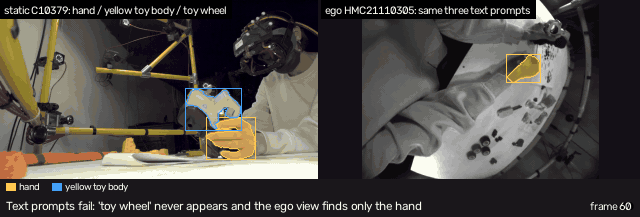

The number that changed: concepts started by text, two of three on the static camera and one of
three on the head camera.

Evidence: `runs/muggledsam-sam3-smoke-static-c10379-20260909t025854z/` and
`runs/muggledsam-sam3-smoke-ego-hmc21110305-20260909t025910z/`; archive entries
[core-method smoke](archive/method-ledger.md#sep-8-late-evening-muggledsam-sam3-core-method-smoke-g2)
and [ego monochrome diagnostic](archive/method-ledger.md#sep-8-late-evening-muggledsam-sam3-ego-monochrome-diagnostic).

## Sep 9: box seeds replace text prompts

**Boxes drawn on frame 0 gave the head camera both hands and both toy parts, and then the first
frame proved a poor seed.** A browser workspace replaced an OpenCV prompt tool within an hour,
and I picked a second head camera (e4) because it started every concept. Four seeded targets
covered 98 to 100% of the 5,400 frames. Watching the result beside the static camera showed the
tracked "toy wheel" was the wrong part, so the vocabulary changed. A seed drawn on one frame
does not describe a part that turns, which is what the next run addressed.

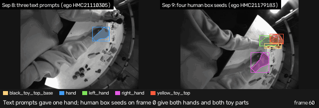

The number that changed: targets tracked on the head camera, one to four, at 98 to 100% frame
coverage over 180 s.

Evidence: `runs/muggledsam-sam3-full-ego-manual-seed-multiplexed-ego-hmc21179183-20260910t024052z/`;
archive entries [four-target baseline](archive/method-ledger.md#sep-9-evening-four-target-180-second-ego-baseline)
and [the head-camera screen](archive/run-report-assembly101-ego-viewpoint-screen.md).

## Sep 10 to 12: no runs

- Sep 10: the labeling workspace's two-step flow became one "Finalize tracking plan" action. No run.
- Sep 11: no work.
- Sep 12: no work.

## Sep 13: masks leak between keyframes

**Seeded masks on the head camera leaked from one part to the next between keyframes, and
corrections at three later frames reset them.** With corrections at frames 75, 150 and 240,
three of four targets were present on every frame of the 300-frame clip, the best head-camera
result so far. The same evening found that the worker had thrown away SAM3's own score and
clamped its presence logit, so every observation read confidence 1.0. Recording both signals
split the failures in two: one loss the model knew about, and five where it was confidently
wrong. A resolution sweep fixed the encoder side at 720 px, and the repository got its first
commits after five days of work.

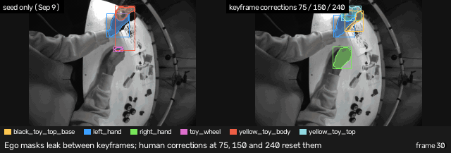

The number that changed: the weakest target's IoU rose 44% from 504 to 720 px encoder side,
and 1,193 observations stopped reading confidence 1.0.

Evidence: `runs/muggledsam-sam3-smoke-multi-keyframe-corrections-ego-hmc21179183-20260913t221457z/`;
archive entries [multi-keyframe corrections](archive/method-ledger.md#sep-13-evening-muggledsam-sam3-e4-multi-keyframe-human-corrections)
and [tracker diagnostics](archive/method-ledger.md#sep-13-evening-tracker-score-and-iou-diagnostics).

## Sep 14: no text prompt finds the black base

**Five text prompts for the black toy base all failed, one of them on an unrelated black
fixture, so I seeded the base from a mask picked among the decoder's
candidates.** The static camera's hybrid run kept text prompts for both hands and the yellow
top and used that one reviewed mask for the base, over all 5,400 frames. Reviewing the toy piece
by piece then showed the composite names were wrong for the task. The vocabulary narrowed to
four physical parts: chassis, interior, rear body and cabin.

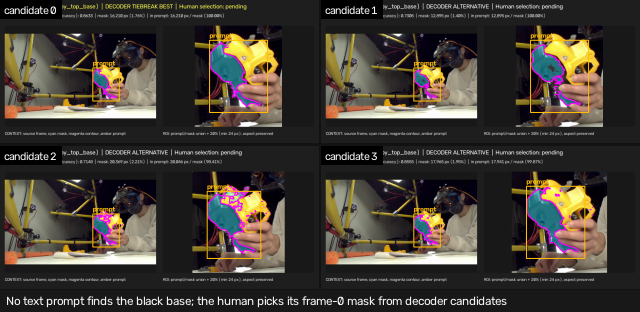

The number that changed: text prompts tried for the black base, five, accepted none; the target
list went from two composite names to four physical parts.

Evidence: `runs/muggledsam-sam3-static-black-toy-top-base-calibration-20260914t022125z/` and
`runs/muggledsam-sam3-g3-full-hybrid-static-static-c10379-20260915t005919z/`; archive entry
[aligned static hybrid](archive/method-ledger.md#sep-14-aligned-static-hybrid-candidate).

## Sep 15: stable slots, unstable identities

**Four tracked slots kept their ids for 5,901 frames while the masks inside them swapped
parts.** In the exploratory full run the chassis and cabin masks sat on the same object at
about 0.9 IoU within the first minutes, so a stable id said nothing about a stable identity.
The window moved to the point where all four parts start separated and are then assembled,
92.7 s of video, with a fresh seed and corrections at three later frames.

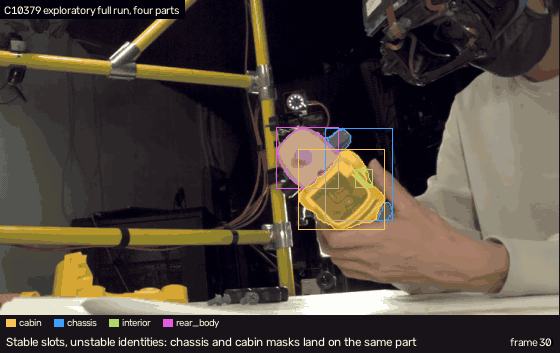

The number that changed: frames where two parts' masks overlapped above 0.5 IoU, 111 in the
exploratory run to 1 in the focused run.

Evidence: `runs/muggledsam-sam3-four-part-static-full-exploratory-static-c10379-20260916t012945z/`
and `runs/muggledsam-sam3-four-part-static-focused-reassembly-static-c10379-20260916t023700z/`;
archive entry [four-part static reassembly](archive/method-ledger.md#sep-15-four-part-static-reassembly-experiment).

## Sep 16: the exploratory queue drifts off the parts

**Eight more methods ran in one unattended pass, and on the same 20 s two of the three
challenger trackers drifted off the parts SAM3 held.** Grounded-SAM-2 with an open vocabulary
and SAMURAI with the reviewed seeds both wandered; DAM4SAM held and then slipped near frame 330.
WiLoR, BoxMOT, CLIP with Drop-DTW, ATHENA and Kineo reached smoke tier: ATHENA stalled on
missing intrinsics and Kineo produced a body only. MediaPipe hands became the second core
method, and one review recording gathered everything.

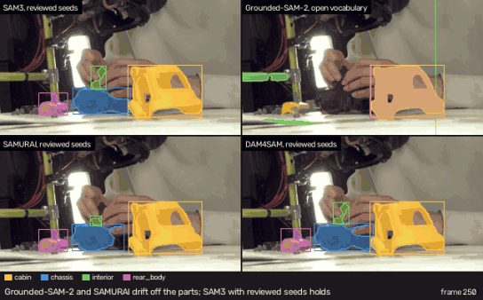

The number that changed: methods attempted, one to ten in one day; on the shared 20 s, one of
three challengers stayed on all four parts.

Evidence: `runs/grounding-dino-sam2-open-vocabulary-four-part-20s-20260916t1004z/`,
`runs/samurai-four-part-reviewed-seed-20s-20260916t1007z/` and
`runs/dam4sam-four-part-reviewed-seed-20s-20260916t1009z/`; archive entries
[exploratory queue](archive/method-ledger.md#sep-16-exploratory-queue-autonomous-pass) and
[four-part comparison](archive/method-ledger.md#sep-16-focused-static-four-part-segmentation-comparison).

## Sep 17: the first human review finds the swap

**The first close review of the minute named the failures the measures had not: the interior
leaks into the chassis as the part turns, and the two labels swap as a hand sweeps past.** An
automatic correction at frame 1172 landed inside the swap and did not undo it; a correction I
picked at 1235 did. A correction at the leak onset (frame 1020) did not hold either.
The first minute became the comparison unit, DAM4SAM ran over it, and a per-part reference took
DAM4SAM's chassis inside the failing interval. Label-free review measures ranked 198 episodes for
the next review.

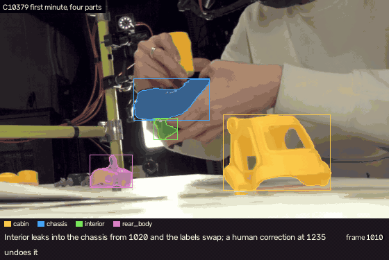

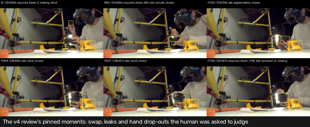

The number that changed: the comparison unit shrank from 92.7 s to the first 60 s, and I marked
the interior hidden over frames 1024 to 1172.

Evidence: `runs/interaction-review-first-minute-v4/` and
`runs/muggledsam-sam3-four-part-static-focused-reassembly-static-c10379-20260918t001210z/`;
archive entries [v4 human review](archive/method-ledger.md#sep-17-first-minute-v4-human-review-and-follow-up-rebuild)
and [leak onset](archive/method-ledger.md#sep-1718-leak-onset-correction-attempt-20-s-v5-hand-layer-dam4sam-first-minute).

## Sep 18: eight cameras disagree

**Eight static cameras on one rig flagged the chassis failure by disagreeing about it, and
fixed nothing.** Overnight, a queue fetched the seven other static views, fitted their clocks and
cameras, and ran SAM3 on each from seeds transferred by geometry. A cross-view consensus and a
carved visual hull both threw C10379's chassis out over frames 1620 to 1700, and both flagged
the swap window the review had named. ATHENA triangulated hands against the dataset's, Kineo ran
on all eight cameras, and LM-EEC mapped parts into the head camera. Every number from that
night is disagreement between estimates.

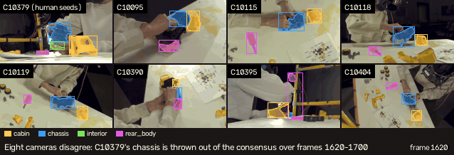

The number that changed: cameras on one timeline, 2 to 12, with 25 queued GPU jobs and 25
successes.

Evidence: `runs/multiview-static-comparison-first-minute/` and
`runs/muggledsam-sam3-four-part-multiview-first-minute-static-*/`; archive entries
[cross-view SAM3](archive/method-ledger.md#sep-18-track-2-of-the-overnight-multicam-pass-cross-view-sam3-with-a-geometric-combiner)
and [visual hulls](archive/method-ledger.md#sep-18-track-5-of-the-overnight-multicam-pass-per-part-visual-hulls-from-eight-silhouettes).

## Sep 19: anchors become the yardstick

**My 52 anchor masks replaced self-consistency as the yardstick, and the first thing they
showed was the swap window.** Chassis and interior fell to 0.0 to 0.6 IoU on frames
1050 to 1150 for the reference and the best arm alike. The label-free proxies had also been
wrong about resolution: 1280 px beat 720 px on the anchors and 1920 px saturated. Appending
corrections to SAM3's prompt memory was the one memory change that helped. DAM4SAM under the
same schedule tied SAM3 at 1280 px (0.715 against 0.724). Nineteen arms went into one table.

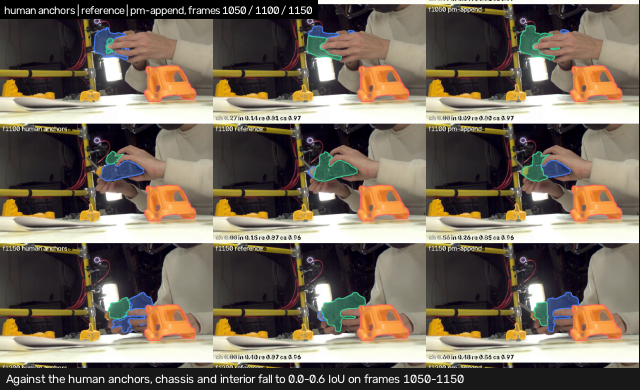

The number that changed: the best arm scored 0.743 mean IoU on the 52 anchor cells against the
old reference's 0.668.

Evidence: `runs/anchor-scoreboard-20260919/`; archive entries
[review anchors](archive/method-ledger.md#sep-18-human-review-anchors-labeling-run-prepared-not-labelled-sep-18-labelled-sep-19),
[memory arms](archive/method-ledger.md#sep-19-sam3-correction-memory-arms-on-c10379-at-1280-plan-step-1b)
and [anchor scoreboard](archive/method-ledger.md#sep-19-anchor-scoreboard-over-every-first-minute-arm-plan-step-3-scoring-half).

## Sep 20: other cameras detect the failure and cannot fix it

**Corrections proposed by the other cameras reached the seed-only floor and never the level
of my corrections, so multicam is a detector, not yet a corrector.** SAM3's own object score
ranked its failures (AUROC 0.91 to 0.96) but no threshold transferred. Seeds for the rear body
and cabin transferred from other cameras; the chassis and interior did not. On the interior
window the consensus corrections scored 0.29 and 0.32 IoU against the anchors, where mine
scored 0.64 and 0.59. A second recording ran with zero human input and stayed
unscored, and the review surface became one recording with three presets.

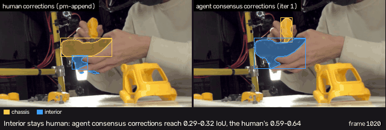

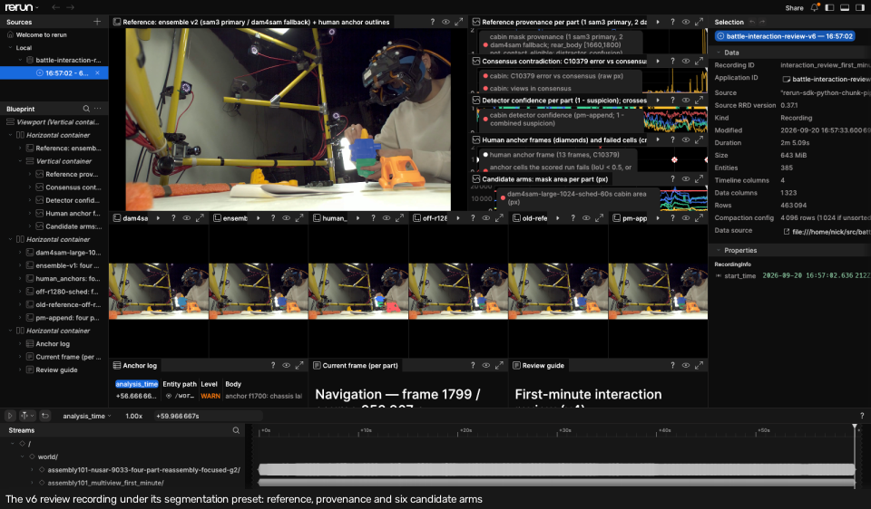

The number that changed: corrections from the other cameras reached 0.659 mean IoU against
0.743 with my corrections, and 0.288 against 0.585 on the interior.

Evidence: `runs/multiview-reprompt-20260920/` and `runs/interaction-review-first-minute-v6/`;
archive entries [the consensus re-prompt loop run](archive/method-ledger.md#sep-20-b4-arms-on-c10379-the-consensus-re-prompt-loop-run-multicam-plan-headline-commits-78f2eca-21da378-cf8007e)
and [v6 review surface](archive/method-ledger.md#sep-20-v6-review-surface-one-recording-with-three-blueprint-presets-track-d-of-the-multicam-plan).

## Sep 21: FineBio arrives and text fails on the plate

**On the wet-lab bench SAM3's text prompts never found the transparent 6-well plate or the tube
rack, and FineBio's shipped detector boxed both on every frame.** One 20 s head-camera clip and
five prompts: three concepts started at frame 0, the plate and the racks found nothing, and the
pipette was lost at frame 106. The detector, run on the CPU beside it, put `cell_culture_plate`
on all 600 frames and six rack classes on the racks. The box became the way in. The same night I
acted on the Assembly101 labeling sessions and added a distractor guard.

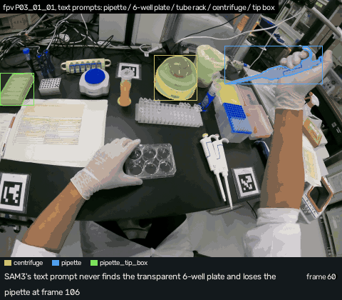

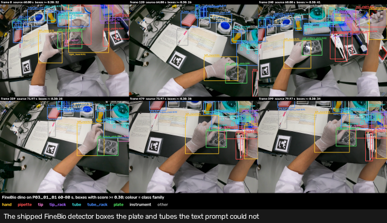

The number that changed: frames with the plate found, 0 of 600 by text prompt and 600 of 600 by
the detector's box.

Evidence: `runs/finebio-sam3-smoke-20260921/` and `runs/finebio-dino-20260921/`; archive
entries [FineBio first look](archive/method-ledger.md#sep-21-finebio-first-look-sam3-zero-shot-text-prompts-on-one-first-person-clip)
and [FineBio shipped detector](archive/method-ledger.md#sep-21-finebio-shipped-detector-first-run-mmdetection-dino-and-deformable-detr-on-the-cpu-beside-the-sam3-smoke).

## Sep 22 and 23: cleanup, then nothing

- Sep 22: SAM3's own appearance signals were scored as failure detectors, and three deduplication passes removed 1,675 lines with equivalence proven on three artifacts. No new result.
- Sep 23: no work.

## Sep 24: camera 6 is 94 px off its shipped pose

**The preflight found the top-down camera's shipped pose 94 px off the bench markers, and
re-solving it from the markers brought it to 0.7 px.** The Assembly101 phase closed first,
tagged, with 3.67 GB of unreferenced runs deleted. Then I checked every assumption behind the
FineBio plan before anything ran: the camera mapping, synchronization within one frame, static
objects triangulated to half their heights, and the transparent plate masked in all six views
from the detector's box. The in-hand object was the weakest detection in every fixed view. I
rewrote the plan on what the preflight found, chose the trial windows and built the detector for
the GPU.

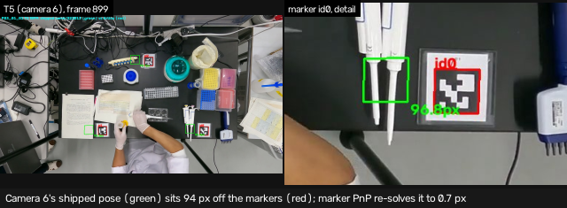

The number that changed: camera 6's marker residual, 94 px shipped to 0.7 px re-solved.

Evidence: `runs/preflight-finebio-20260924/`; archive entries
[the preflight](archive/preflight-2026-09-24-finebio.md),
[Assembly101 phase closed](archive/method-ledger.md#sep-24-assembly101-phase-closed) and
[plan approved, trial windows chosen](archive/method-ledger.md#sep-24-night-plan-approved-trial-windows-chosen-p0-trials-p-docs).

## Sep 25: the 3D tracker runs in both rooms

**A six-camera 3D tracker ran end to end on trial 1 and then, with nothing tuned, on trial 2;
per-frame box decode beat SAM3's video memory, and the pipette in the hand fragmented.**
Cameras, rig, proxies, seeds, detector runs on 86,400 frames, four arms and the tracker went
from fixtures to a review recording in one day. A fresh mask decoded from the detector's box on
every frame agreed with the box on 99.1% of masks; video memory, seeded once, on 79.3%, and
re-seeding it made it worse. Four extensions (motion model, containers, groups, held objects)
cut spurious track births by 40% (308 to 186) and identity ambiguities by two-thirds (158 to
54). A micro tube kept one identity through both closed-lid spins. The blue pipette in the hand
split into 59 identities in two minutes.

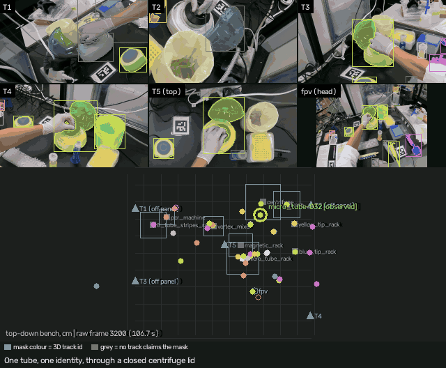

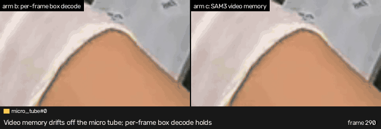

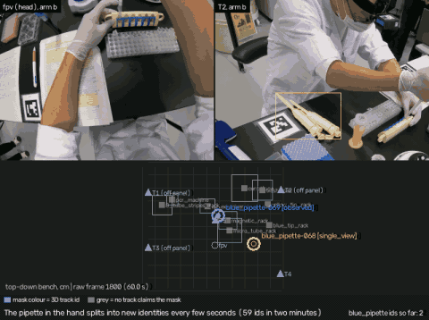

Trial 2 (room 2, recording `P20_03_01`) went through the same pipeline with the trial id as the
only change. Four of its cameras were 15 to 32 px off their shipped poses and were re-solved to
0.7 to 2.1 px. Per-frame box decode agreed with the detector on 98.5% of masks, video memory on
65.3%. The static objects were one identity each, two tubes kept their ids through three spins,
and the yellow pipette in the hand fragmented into 48. Three things were named as overfit to
room 1: the rig's witness class list, which put the hand-off gate at its 80 px cap; the slot
cap, which gave a rack the plate's slot; and the viewer's negative control drawn for camera 6
only.

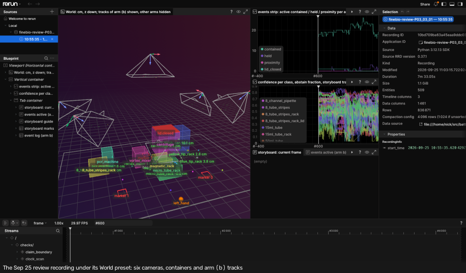

The number that changed: masks agreeing with the detector's box at 0.5 IoU or above, 99.1%
per-frame decode against 79.3% video memory in room 1, and 98.5% against 65.3% in room 2.

Evidence: `runs/finebio-arms-P03_03_01-20260925/`, `runs/finebio-arms-P20_03_01-20260925/` and
`runs/finebio-review-P03_03_01-20260925/`; archive entries
[tracking arms on trial 1](archive/method-ledger.md#sep-25-tracking-arms-on-trial-1-p4-arms-p1-rig-run),
[tracker extensions](archive/method-ledger.md#sep-25-tracker-extensions-on-the-inventorys-evidence-p3-tracker-ext)
and [second trial with zero tuning](archive/method-ledger.md#sep-25-second-trial-p20_03_01-with-zero-tuning-p6-trial2).

## Sep 26: gate 1 rejects six seeds

**I accepted 52 of the 60 detector seeds, rejected 6 and left 2 undecided, and the arithmetic
said the verdicts would not move.** Three rejects were two objects under one box, one
had a glove inside the mask, one caught the table edge, and one was hidden by a hand on its seed
frame. The six slots were 9% of the SAM3 rows; removing them would lift per-frame box decode
from 99.1% to about 99.4% and video memory from 79.3% to about 81.4%. The same day the gate 2
workspace became web pages with one keypress per row, because a 7,866-line decisions file was
not going to be edited by hand.

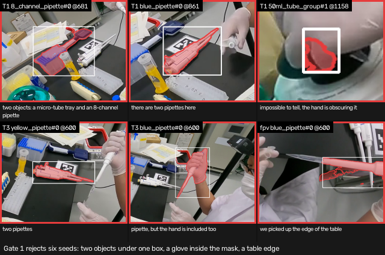

The number that changed: seed slots kept on trial 1, 66 to 60 with the plate, and no verdict
moved.

Evidence: `runs/finebio-seeds-P03_03_01-20260925/` and
[`qa/finebio-P03_03_01-seed-decisions.human-record.json`](qa/finebio-P03_03_01-seed-decisions.human-record.json);
archive entries [gate 1 held](archive/method-ledger.md#sep-26-gate-1-held-seed-decisions-on-trial-1-p2-gate1)
and [gate 2 web workspace](archive/method-ledger.md#sep-26-gate-2-web-workspace-battle-finebio-anchors-web).

## Sep 27: gate 2 rejects 30 masks and the redo holds

**On 337 anchor cells I took per-frame box decode's own mask 307 times and rejected it on 30,
almost all pipettes in a hand; the ranking held with a smaller gap.** Against the
accepted masks, per-frame box decode scored 0.984 mean IoU and 98.8% at 0.5 or above, video
memory 0.897 and 93.5%. The label-free gap of 20 percentage points became 5, because the 18
frames sample video memory's dead slots instead of counting every frame of them. Video memory won
identity through the centrifuge lid, one id where the per-frame decode had two. Trial 1 was then
redone on the seeds gate 1 kept: per-frame decode 0.928 and 99.3%, video memory 0.915 and
80.4%, its drift moved between slots rather than removed. Finally, I deleted 270 GB of re-seed
checkpoints.

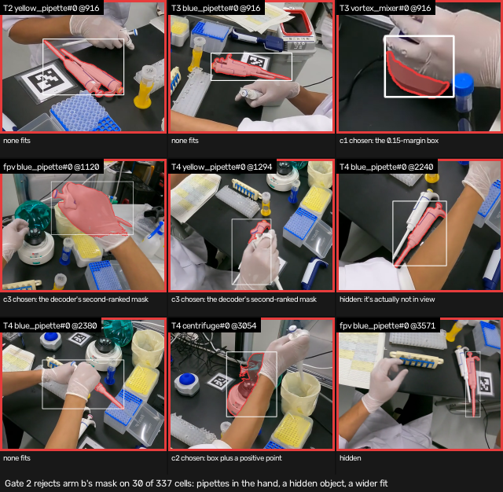

The number that changed: the gap between per-frame box decode and video memory on masks at 0.5
IoU or above, 20 percentage points against the detector's box to 5 against my choice.

Evidence: `runs/finebio-anchors-P03_03_01-20260925/scoreboard/` and
`runs/finebio-arms-P03_03_01-filtered-20260927/`; archive entries
[gate 2 held](archive/method-ledger.md#sep-27-gate-2-held-the-anchor-scoreboard-on-trial-1-p6-anchors)
and [the redo on the filtered seeds](archive/method-ledger.md#sep-27-trial-1-downstream-redone-on-the-human-filtered-seeds-post-gate).

## Sep 28 to 29: pipettes as 3D lines, and where it stopped

**Tracking the pipettes as 3D line segments instead of box centres failed its pre-registered
rule on all three clauses, and the failure named what to change next.** The point tracker
reduces each camera's mask to one point, and a 30 cm pipette seen from above, from the side and
from the head camera gives three different points on the shaft. So I fitted a 3D line to the
mask axes instead, with a length prior, a hold on the hand and a colour vote at the plunger.
Four attempts ran on both trials with nothing tuned between them. The held blue pipette fell
from 51 ids to 18, a 2.8x fall where the rule asked for 5x, and the yellow pipette in room 2
from 48 to 17. The held-out residual against the box centre was a draw within a pixel, and it changed
sign between the rooms. On 48 tip anchors I clicked at the cone end, the median tip error was
3.03 cm against a 2 cm rule, with the wrong end named on 14 of 47. Across the axis the line
sits within about 2 cm of my clicks in every arm, so the axis is right and the end choice
fails, and the frames where the hand covers the shaft still end an id.

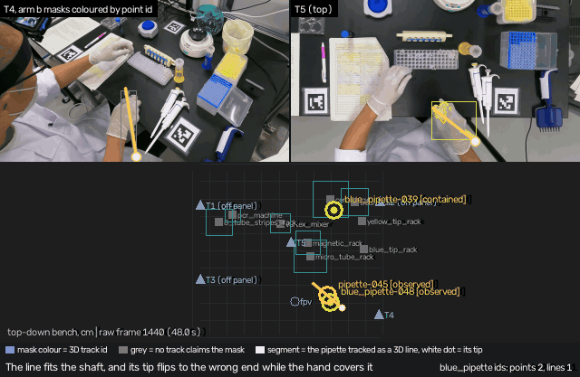

The bench gave up facts along the way that stand. The pipettes rest flat on the bench, not
upright in a stand. The colour is the plunger button, not a ring at the tip. The disposable tip
sits inside SAM3's mask when one is on, so the blue pipette's length has two modes, 22.3 and
29.5 cm. The detector's tip classes fire on 1% of pipette rows, and SAM3 given an empty box
returns a blob the size of the box. My first click sitting accepted a suggested marker and
measured the plunger end on half its cells, so I redid it without a marker. The click anchors
also read the id gain: over the 30 click frames the blue pipette spans ten line ids, the same
ten as the point tracker, and the one long line track is the resting red pipette absorbing the
anchors the detector's blue class put on it. The next lever is a tracker change: carry a held
pipette on the triangulated hand and refuse a new id until the hand lets go. That plan is being
written.

The number that changed: ids on the held blue pipette, 51 to 18, against the fall to 10 or
fewer the rule asked for; the tip error median 3.03 cm against 2 cm.

Evidence: `runs/finebio-lines-P03_03_01-20260928/`, `runs/finebio-lines-P20_03_01-20260928/`,
`runs/finebio-tipseg-P03_03_01-20260929/`, `runs/finebio-tips-P03_03_01-20260929/` and the two
click records [`qa/finebio-P03_03_01-tip-clicks.human-record.json`](qa/finebio-P03_03_01-tip-clicks.human-record.json)
and [`qa/finebio-P03_03_01-tip-clicks-2.human-record.json`](qa/finebio-P03_03_01-tip-clicks-2.human-record.json).
The archive closed before this phase, so the run READMEs are its record.

## Sep 29: the orientation vote names the cone

**The orientation vote passes its pre-registered rule.** I replaced the ordered tip heuristics with
five cues: colour, taper, hand side, gravity and attached tip boxes. The clean clicks give 1 wrong
end among 47 matches, against 14 on the third attempt and eight on the fourth. Median error falls to
2.38 cm, under the rule’s 2.5 cm ceiling. Rest error improves to 1.26 cm and held error to 4.27 cm.

The colour control names the opposite end and raises wrong ends to 9. The hand cue agrees with the
final episode orientation on only 39% of its room 1 frames. It had been allowed to overrule the
other evidence. The offline pass now labels each episode from its strongest accumulated evidence,
leaving the online hold untouched.

Both rooms ran with the same flags. Room 1 still has 13 online orientation flips and room 2 has 37.
The held pipettes still split into 21 ids in room 1 and 20 in room 2. The vote solves the endpoint
labels on the clean clicks; the identity problem remains.

Evidence: `runs/finebio-lines-P03_03_01-20260928/orientation_readout.json`, both trials’
`scoreboard-v5a/` and `runs/finebio-tips-P03_03_01-20260929/scoreboard-v5a/`. The run READMEs record
this phase.
